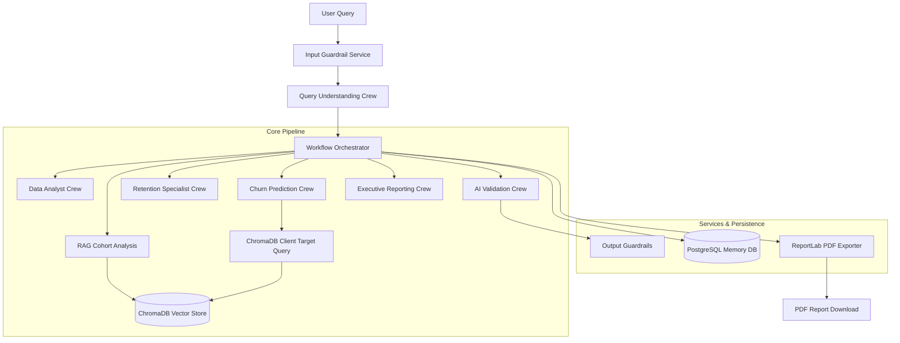

# BNP Paribas Churn Intelligence Platform

An advanced Multi-Agent Agentic AI platform built to analyze client portfolio metrics, predict churn risks, suggest retention strategies, audit system outputs for hallucinations, and compile executive-ready PDF reports.

Powered by **CrewAI**, **ChromaDB**, **FastAPI**, **Streamlit**, and **PostgreSQL**.

---

## 🌟 Key Architecture & Features



### 1. Vector Store & Proper RAG (ChromaDB)
- **Zero CSV Runtime Dependencies**: All client profiles and metrics are fully ingested into a local ChromaDB collection using `SentenceTransformer (all-MiniLM-L6-v2)` embeddings.
- **Dynamic Portfolio Metrics**: Churn rates, portfolio counts, average tenure, and client age are calculated dynamically directly from ChromaDB metadata.
- **Direct Target Querying**: Predicts risks by loading target customer metadata directly from ChromaDB by ID.

### 2. Comprehensive Explainability
Every agent output is formatted with Pydantic models containing explicit:
- `evidence`: Quotes or variables extracted from the verified customer profile/data.
- `reasoning`: Step-by-step logic behind the agent's calculations or decisions.
- `confidence`: Certainty score (percentage) reflecting output reliability.

### 3. Strict Input & Output Guardrails
- **Input Sanitization**: Rejects malicious prompts, SQL injections, and query lengths exceeding 1000 characters. Rejects out-of-context queries.
- **Output Audit (Validation Crew)**: Programmatic constraints (checking boundary parameters) combined with LLM validation checks. Verifies numerical consistency, checks for hallucinations, and catches logical contradictions (e.g. flagging predictions/retentions targeted at clients who have already churned).

### 4. PostgreSQL Session Memory
- Persists user queries, intent plans, retrieval contexts, analysis details, risk scores, recommendations, validation reports, and explainability logs into a relational PostgreSQL `memory` schema.

### 5. ReportLab PDF Exporter
- Generates polished, corporate-branded (BNP Paribas theme) PDF executive reports containing portfolio stats tables, client risk grids, action plans, and complete validation audit checks.

---

## 📁 Repository Directory Structure

```text
├── backend/
│   ├── api/
│   │   └── app.py                  # FastAPI Application Server
│   ├── crews/
│   │   ├── config/                 # YAML configurations for Agents and Tasks
│   │   │   ├── database.py         # Postgres Connection setup
│   │   │   └── llm.py              # Ollama LLM setup
│   │   ├── customer_churn_crew.py  # Intent Parser Crew
│   │   ├── data_analysis_crew.py   # Cohort Analyzer Crew
│   │   ├── prediction_crew.py      # Rule-based Scoring Crew
│   │   ├── recommendation_crew.py  # Retention Strategy Crew
│   │   ├── validation_crew.py      # LLM Validator Crew
│   │   └── reporting_crew.py       # Report Writer Crew
│   ├── memory/
│   │   └── memory_service.py       # PostgreSQL Memory Client
│   ├── schemas/                    # Pydantic schema models
│   ├── services/
│   │   ├── guardrail_service.py    # Input/Output Guardrails
│   │   ├── pdf_service.py          # ReportLab PDF Exporter
│   │   ├── data_analysis_service.py# ChromaDB dynamic statistics
│   │   └── prediction_service.py   # ChromaDB client risk scoring
│   ├── vectorstore/
│   │   ├── chroma_service.py       # ChromaDB Connection wrapper
│   │   ├── ingestion_service.py    # CSV to ChromaDB ingestion service
│   │   └── retriever.py            # Vector DB similarity search
│   └── main.py                     # CLI entrypoint script
├── database/
│   └── init_db.py                  # PostgreSQL tables initialization script
├── datasets/
│   └── BNPParibas_Data.csv         # Initial customer raw dataset
├── frontend/
│   └── app.py                      # Streamlit Dashboard UI Application
├── requirements.txt                # Python environment package list
└── .gitignore                      # Git ignored files & caches
```

---

## ⚙️ Setup & Installation Instructions

### 1. Prerequisite Installations
- **Python**: v3.10+
- **PostgreSQL**: Local or remote instance running.
- **Ollama**: Local instance with the LLM running (or configured remote API key in `.env`).

### 2. Configure Environment `.env`
Create a `.env` file in the root directory:
```env
OLLAMA_API_KEY=your_ollama_api_key_here
LANGSMITH_API_KEY=your_langsmith_api_key
LANGSMITH_TRACING=true
LANGSMITH_PROJECT=customer-churn-agentic-ai
CHROMA_DB_PATH=./database/chroma
CREWAI_TRACING_ENABLED=true

# Database Credentials
DATABASE_HOST=localhost
DATABASE_PORT=5432
DATABASE_NAME=customer_churn_ai
DATABASE_USER=postgres
DATABASE_PASSWORD=root
```

### 3. Initialize Python Virtual Environment
```powershell
# Create venv
python -m venv venv

# Activate venv
.\venv\Scripts\Activate.ps1

# Install requirements
pip install -r requirements.txt
```

### 4. Setup Databases
```powershell
# 1. Initialize PostgreSQL Tables
python database/init_db.py

# 2. Ingest Dataset to ChromaDB Vector Store
python -m backend.test_ingestion
```

---

## 🚀 Running the Platform

### 1. Launch FastAPI Backend Server
```powershell
uvicorn backend.api.app:app --host 127.0.0.1 --port 8000
```
- API Docs will be available at: `http://127.0.0.1:8000/docs`

### 2. Launch Streamlit Web UI Dashboard
Open a new shell session (with virtual environment activated):
```powershell
streamlit run frontend/app.py --server.port 8501
```
- Streamlit Web Dashboard will open at: `http://localhost:8501`

---

## 🌿 Git Staging Branches

The project follows a structured Git branching strategy:
- `feature/core-setup`: Basic environment setup, libraries, datasets, and configurations.
- `feature/vectorstore-rag`: Database initializer, ChromaDB ingestion and retrieval workflows.
- `feature/agentic-pipeline`: Multi-agent CrewAI configurations, schemas, and orchestrator graph routing.
- `feature/guardrails-pdf`: Input safety guardrails, output validators, and ReportLab PDF exporters.
- `feature/api-frontend`: FastAPI endpoints and Streamlit dashboard components.
